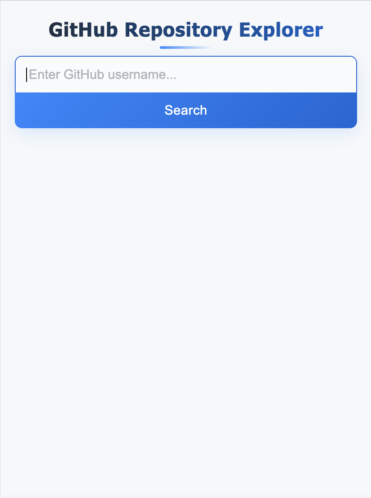
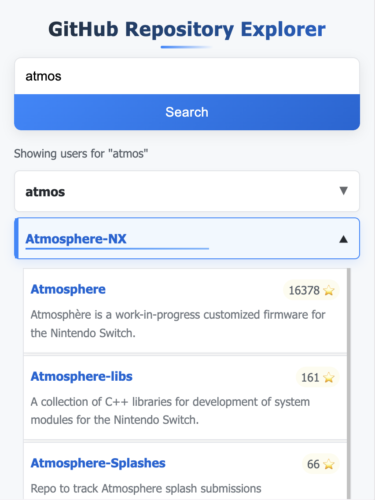

# GitHub Repository Explorer

A React application built with TypeScript that integrates with GitHub's API to search for users and display their repositories. This project was created to showcase React, TypeScript, and GitHub API integration, with an enhanced focus on mobile responsiveness and UI animations.




## Live Demo

You can access the live demo of the application [here](https://pecopero.github.io/github-repo-explorer/).

## Features

- Search for GitHub users (up to 5 results)
- View repositories for a selected user
- Responsive design with different layouts for desktop and mobile
- Mobile-optimized dropdown repository view with custom scrollbars
- Smooth animations and transitions for improved user experience
- Error handling for API requests
- Loading states for better UX
- Keyboard navigation support

## Technologies Used

- React with Hooks
- TypeScript
- Styled Components for styling
- Axios for API requests
- GitHub REST API v3

## Getting Started

### Prerequisites

- Node.js (version 16 or higher)
- npm or yarn

### Installation

1. Clone the repository:
   ```bash
   git clone https://github.com/yourusername/github-repo-explorer.git
   cd github-repo-explorer
   ```

2. Install dependencies:
   ```bash
   npm install
   # or
   yarn install
   ```

3. Start the development server:
   ```bash
   npm start
   # or
   yarn start
   ```

4. Open your browser and navigate to `http://localhost:3000`

## Usage

1. Enter a GitHub username in the search box
2. Click the "Search" button or press Enter
3. Click on a user from the search results to view their repositories
4. Browse through the user's repositories

## Deployment

This app is configured for deployment on GitHub Pages.

```bash
npm run deploy
# or
yarn deploy
```

## API Rate Limiting

Please note that the GitHub API has rate limits. For unauthenticated requests, the rate limit is 60 requests per hour. For more information, check the [GitHub API documentation](https://docs.github.com/en/rest/overview/resources-in-the-rest-api#rate-limiting).

## Mobile Dropdown Feature

This application features an enhanced mobile experience with a dropdown repository view:

- On mobile devices (screen width <768px), repositories appear as dropdowns under each username
- Click on a username to expand/collapse its repository list
- Smooth animations when expanding/collapsing the dropdown
- Maximum height with automatic overflow scrolling
- Repository items have hover effects and animations

## License

This project is licensed under the MIT License - see the LICENSE file for details.
